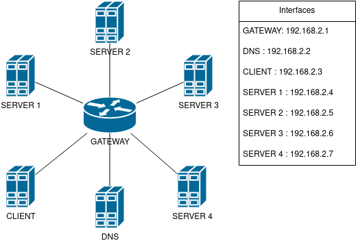

# Using Postfix's DNS SRV record resolution feature

In March 2011 Apple Inc. proposed [RFC 6186](https://www.ietf.org/rfc/rfc6186.txt) which describes how DNS SRV records should be used
for locating email submission and accessing services. The design presented in the RFC is now supported by Postfix since version 3.8.0. With the new functionality, it is now possible to use DNS SRV records for load distribution and auto-configuration.

## How does DNS SRV record look like

DNS SRV records were defined in [RFC 2782](https://www.ietf.org/rfc/rfc2782.txt) and are specified in zone files as the service name, transport protocol
specification, priority, weight, port and host which provides the service.

`_submission._tcp	SRV 5 10 50 bruce.my-domain.com.`

| Field | Value | Meaning |
|---|---|---|
| service name | submission | service is named submission |
| transport protocol specification | tcp | service is using TCP |
| priority | 5 | servers priority is 5 (lower gets tried first)|
| weight | 10 | portion of load the server should handle |
| port | 50 | port where server listens for connections |
| fully qualified domain name | bruce.my-domain.com. | name of server providing this service |

## Server selection algorithm

Clients that implement the resolution of SRV records should do it according to how the resolution is described in [RFC 2782](https://www.ietf.org/rfc/rfc2782.txt). That means, first contact the server with the lowest priority. If the server does not respond, try to contact the next server with either the same or higher priority. If there are multiple servers with the same priority, choose one randomly, but ensure the records with zero priority get chosen first and the probability of choosing other records conforms to the equation:

$p_i = \frac{weight_i}{\sum_{n=1}^k weight_n}$

where $i$ is the identification of SRV record and $k$ is the
count of SRV records with the same priority.

There is one case where postfix selection of SRV records differs from the algorithm described in [RFC 2782](https://www.ietf.org/rfc/rfc2782.txt) and that is when zero weight is encountered. [RFC 2782](https://www.ietf.org/rfc/rfc2782.txt) states that such
records should be picked first, but Postfix handles them simply as records with
the lowest weights, e.g. they will be the least often selected ones.

In practice, this means that if you have two servers and one is
3 times as powerful as the other one, then you should give the first weight of value 3 times higher than the other one. This ensures the more powerful server will receive ~75% of client requests and the other one ~25%.

These principles allow SRV records to work as both tools to autoconfigure
clients and distribute the workload among servers.

An example of such a set of records would be:

```
_submission._tcp 	SRV 0 0 2525 server-one.example-domain.com.
_submission._tcp 	SRV 1 75 2625 server-two.example-domain.com.
_submission._tcp 	SRV 1 25 2625 server-three.example-domain.com.
```

Server-one would always be contacted first. If server-one does not respond, the client will shuffle the two remaining records with priority 1, generate a random number from 0 to 100 and if the running sum of the first record is
greater or equal, then try to contact it. Otherwise, the client contacts the servers
in reverse order. Keep in mind that the client will submit the request to the first server it successfully connects to.

## Configuration example

Let's say you are setting up an office full of computers and you are
thinking about how to configure your machines so all outgoing e-mails
are relayed through your company mail server. What you could do is configure `relayhost` parameter of your postfixes, working as a Mail User Agent (MUA) to `$mydomain` which would cause your machines to lookup MX records for your
domain and try to submit mail in the order of their respective priorities.
While this approach would work, there is the issue of load balancing. The
server with the highest priority would be used until it would not respond
and only after that, any secondary servers would be contacted. Additionally, if you are using an environment where ports are assigned dynamically, then you
have no way of telling the clients what port is the particular server using. With SRV records we can prevent that and keep the servers running smoothly without peaks while changing the server's port as we see fit.

### Zone file
The following file is how we would configure our DNS server to provide information to clients. Notice that this domain does not receive mail and our servers will work only as a relay for outgoing post.

```
$TTL  3600
@  	IN SOA  example-domain.com. root.example-domain.com. (
                1571655122 ; Serial number of zone file
                1200       ; Refresh time
                180        ; Retry time in case of problem
                1209600    ; Expiry time
                10800 )    ; Maximum caching time in case of failed lookups
;
   	IN NS   ns1.first-domain.com.
   	IN A    192.168.2.8
;
ns1	IN A    192.168.2.10
server-one           IN A   192.168.2.10
server-two           IN A   192.168.2.11
_submission._tcp     SRV 0 75 2525 server-one.example-domain.com.
_submission._tcp     SRV 0 25 2625 server-two.example-domain.com.
```

### Postfix MUA configuration

Now we have to configure client machines in a way that ensures they
will look for SRV records:

```
use_srv_lookup = submission
relayhost = example-domain.com:submission
smtp_tls_security_level = may
```

This configuration causes postfixes on our client machines to contact DNS server
for example-domain and request its SRV records for submission of mail. Then Postfix
will choose one out of the two records and try to submit mail to it. As per configuration, server-one will be contacted first in roughly 75% of the total cases and server-two in roughly 25%. Please note the weight value does not equal the percentage, the same effect could be achieved with respective values 3 and 1.

Postfix will also know that server-one listens on port 2525 and server-two on port 2625. If you use a way of caching retrieved DNS records and you change the SRV records dynamically, you will have to discard the cache and force retrieval of new records.

### Complete setup


